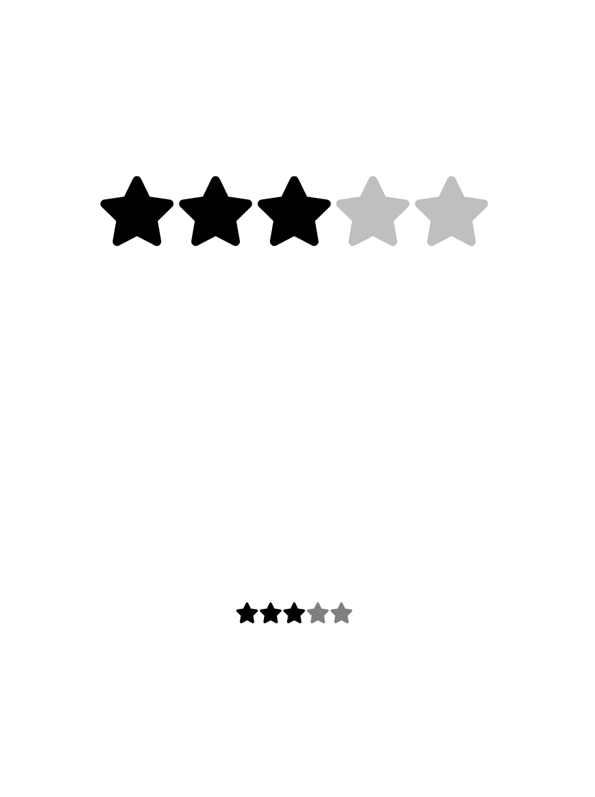

Here I have implemented the stars rating in 2 ways:

***1) Rating.jsx***

Rendering the star is simple in the sense that we use map and render it.

Important part is ***how to make star listen the clicks***. That's why we add Radio element to the component. 

If Radio elements are visible on screen that would not be a great UI experience, hence we need to hide them, but if we hide them then how will user click get to those hidden radio elements.

To solve that we wrap radio and Rating in label element. Label elements interesting property is if we click on label it automatically passes that click to child elements, therefore radio element also gets it.

Hence, that is how we add event listening ability to our star elements.

***2) Rating_mc.jsx***

This code is a simpler one could be used in machine coding rounds.

